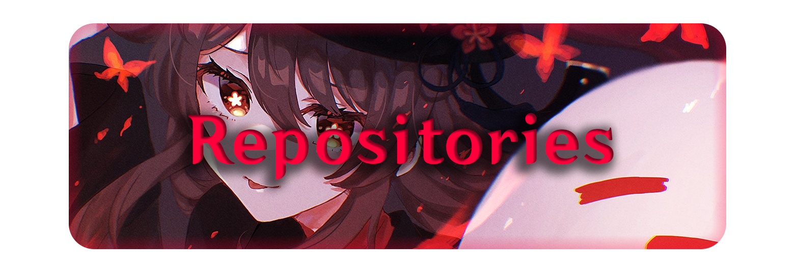
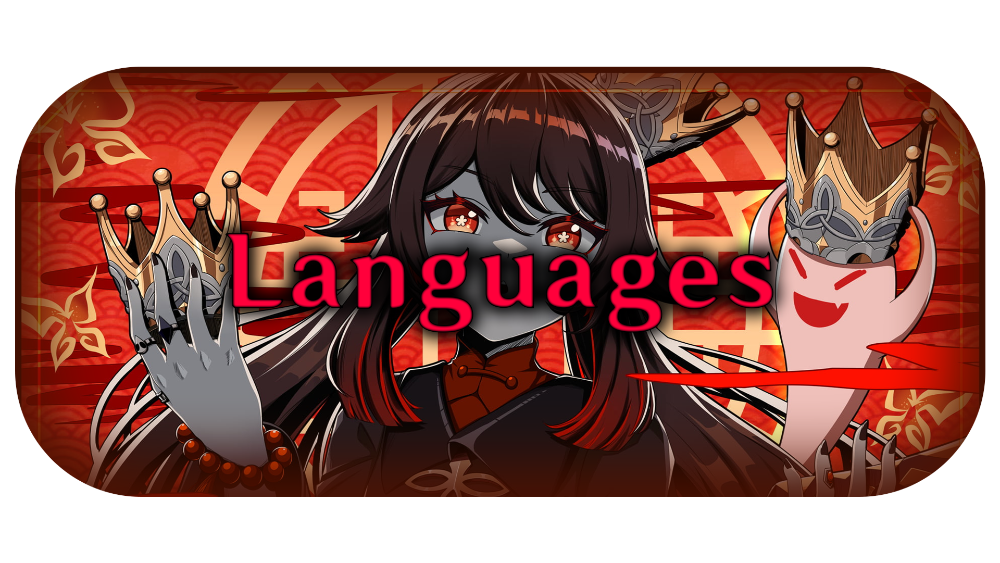

- 📛 Hi, I'm [**Ichimaki Kasura**](https://github.com/IchimakiKasura).
- 🌏 I live in **Manila, Philippines**.
- 📖 I Can speak English, Tagalog and very little 日本語.
- 📖 Still learning 日本語.
- 🌟 Wanna be a Full-stack Developer, a Game Developer or Senior Programmer but
I'm lazy so yeah I have too much high expectation on myself lmao I'd rather call
my self a junior programmer.
- 📬How to Reach or Contact me?
   
      Email me: **ichimakikasura@gmail.com**

<kbd title=" Japanese:
堂主の私に何か用かな？あれ、
知らなかった？私が往生堂七十七代目堂主、
胡桃だよ！でもあなた、ツヤのある髪に健康そうな体してる･･･そっか！
仕事以外で私に用があるってことだね？&#10;
Romaji:
Doushu no watashi ni nanika you ka na? Are,
shiranakatta? Watashi ga Oujou-dou nanajuunanadaime doushu,
Fuutao da yo! Demo anata, tsuya no aru kami ni kenkousou na karada shiteru... Sokka!
Shigoto igai de watashi ni you ga aru tte koto da ne?
"><h3>Yoh, now why might you be looking for me, hm? Oh, you didn't know? 
I'm the 77th Director of the Wangsheng Funeral Parlor, Hu Tao. 
Though by the looks of you... 
Radiant glow, healthy posture... 
Yes, you're definitely here for something other than that which falls 
within my regular line of work, aren't you?</h3></kbd>

 
&nbsp;&nbsp;&nbsp;

 
 
Other Repositories:
 
<a href="https://github.com/IchimakiKasura/kasu.nhentaiapi.cs" title="kasu.nhentaiapi.cs">KasuNhentaiCS<a>
|
<a href="https://github.com/IchimakiKasura/kasu.nhentaiapi.cs/tree/main/kasuNhentaiCS.json" title="KasuNhentaiCS.json">JsonDeserializer<a>
 
 
 
 
   
   

 
 
 
Other ones that I used but not really mastered or good with:
 
(some are not really a language)
 
 
 
 
 
 
 
 
 
 
 
<b>Language Stats:</b>
 

 
 
 
<small>Ichimaki-kun at your funeral service.</small>
 

 

